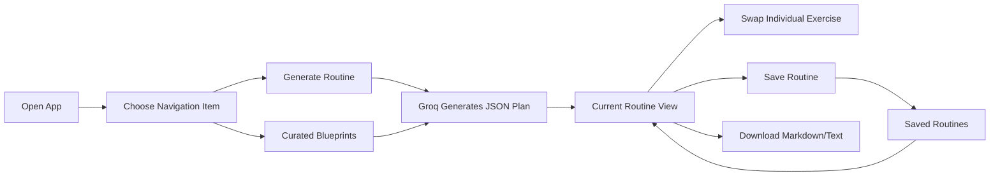

# FitBlueprint Documentation

This folder explains how FitBlueprint is presented to users, how the application is architected, and how the major features work end to end.

## Documentation Map

| File | Purpose |
|---|---|
| [`presentation-style.md`](presentation-style.md) | Visual identity, UI tone, layout rules, Streamlit component styling, and design patterns. |
| [`architecture.md`](architecture.md) | Project structure, module boundaries, data flow, state model, and dependency map. |
| [`functionality.md`](functionality.md) | Feature-by-feature explanation of routine generation, curated blueprints, exercise swaps, saves, exports, and error handling. |
| [`developer-guide.md`](developer-guide.md) | How to run, configure, extend, and safely modify the project. |

## Product Summary

**FitBlueprint** is a Streamlit-based workout planning application that generates structured, CSCS-style workout routines using the Groq API. The app collects clean trainee inputs, sends a constrained prompt to the AI model, renders the returned JSON plan as styled cards, and lets users swap individual exercises without rebuilding the entire program.

## Core Principles

1. **Structured inputs over vague prompts**  
   The app guides users through goal, experience, equipment, duration, frequency, and limitation fields instead of depending on open-ended chat text.

2. **Constraint-first training plans**  
   Equipment, injuries, time, and training frequency are treated as hard constraints in the prompt and validation layer.

3. **Presentation matters**  
   The UI is styled like a premium dark fitness dashboard, using a strong hero banner, card-based layouts, navigation highlights, badges, and clear call-to-action buttons.

4. **Small, focused architecture**  
   The root app file stays lightweight. Business logic, prompts, state, views, reusable components, and formatting helpers live in separate modules.

5. **Recoverable user workflow**  
   Generated routines can be saved, restored, modified, and exported, so the user does not lose useful plans while experimenting.

## High-Level User Flow

## Tech Stack

- **Python 3.9+**
- **Streamlit** for the web interface
- **Groq API** for AI workout generation and exercise replacement
- **python-dotenv** for environment configuration
- **Custom CSS** for the dark presentation system

## Suggested Reading Order

Start with `presentation-style.md` to understand how the app should look and feel. Then read `architecture.md` to understand where each concern lives. Finish with `functionality.md` and `developer-guide.md` when modifying or extending features.
