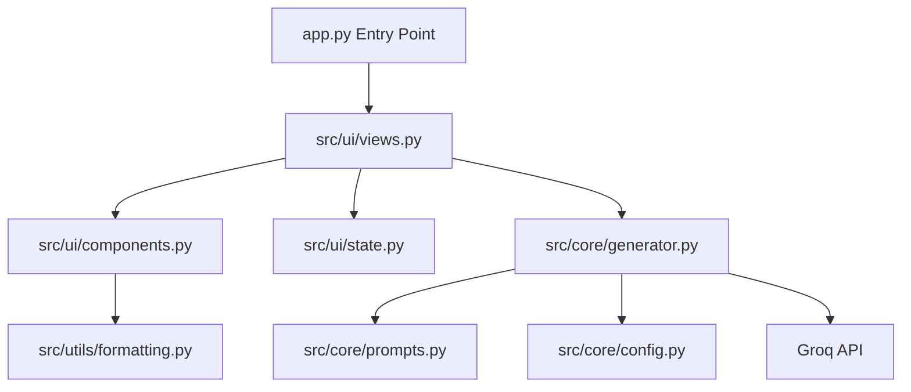
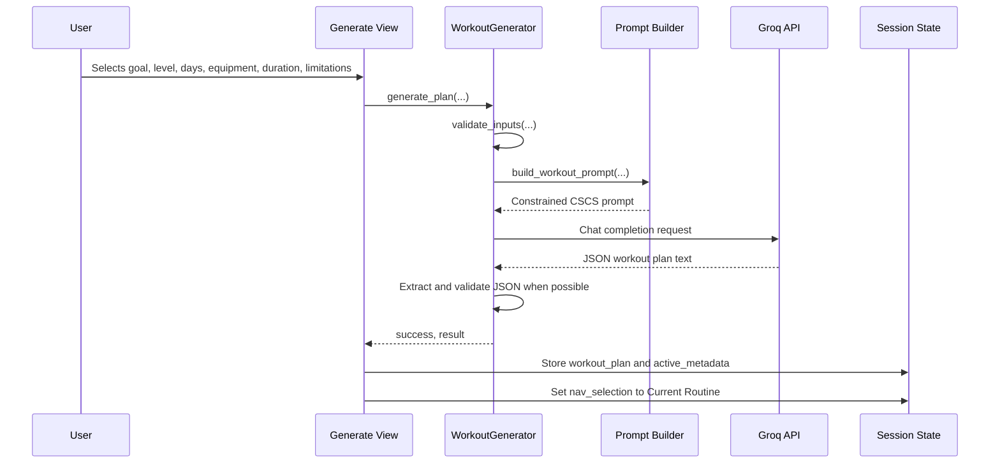
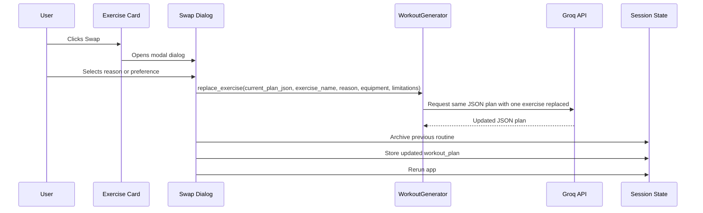

# Application Architecture

FitBlueprint uses a small, package-oriented architecture. The root `app.py` file is intentionally lightweight, while domain logic, prompts, UI views, reusable components, and formatting helpers are separated under `src/`.

## Project Structure

```text
routine-builder-main/
├── app.py
├── styles.css
├── requirements.txt
├── pyproject.toml
├── .env.example
├── README.md
├── docs/
│   ├── README.md
│   ├── presentation-style.md
│   ├── architecture.md
│   ├── functionality.md
│   └── developer-guide.md
├── src/
│   ├── __init__.py
│   ├── core/
│   │   ├── __init__.py
│   │   ├── config.py
│   │   ├── generator.py
│   │   └── prompts.py
│   ├── ui/
│   │   ├── __init__.py
│   │   ├── components.py
│   │   ├── state.py
│   │   └── views.py
│   └── utils/
│       ├── __init__.py
│       └── formatting.py
└── tests/
    └── test_workout_generator.py
```

## Module Responsibility Map

| Module | Responsibility |
|---|---|
| `app.py` | Streamlit page configuration, CSS injection, banner, navigation, and view routing. |
| `styles.css` | Custom dark presentation layer and reusable CSS classes. |
| `src/core/config.py` | Environment helpers and supported Groq model registry. |
| `src/core/prompts.py` | Prompt construction for full workout generation and single-exercise replacement. |
| `src/core/generator.py` | `WorkoutGenerator` class, input validation, Groq API calls, JSON extraction, and error handling. |
| `src/ui/state.py` | Session state defaults, curated preset definitions, and active-routine archiving. |
| `src/ui/components.py` | Reusable UI components such as routine display and exercise swap dialog. |
| `src/ui/views.py` | Full-page Streamlit views: current routine, generation form, curated blueprints, and saved routines. |
| `src/utils/formatting.py` | Converts workout JSON into Markdown and plain text exports. |

## Architectural Pattern

The project follows a simple layered design:



### Layer 1: Entry Point

`app.py` handles only the outer shell:

- Loads `.env` values
- Sets Streamlit page metadata
- Injects `styles.css`
- Initializes session state
- Creates the `WorkoutGenerator`
- Renders the top banner
- Renders navigation
- Routes to the selected view
- Renders the footer

This keeps the file easy to understand and prevents UI pages from being mixed with API logic.

### Layer 2: UI Views

`src/ui/views.py` owns the major screens. Each `render_*_view()` function maps directly to one navigation destination.

The views are responsible for:

- Page titles and captions
- Input widgets
- Button actions
- Streamlit spinners/toasts/alerts
- Calling generator methods
- Updating session state
- Calling reusable display components

### Layer 3: UI Components

`src/ui/components.py` contains smaller reusable UI blocks. These are not full pages. They handle repeated interface patterns such as displaying an exercise plan and opening the swap dialog.

### Layer 4: Core Logic

`src/core/generator.py` wraps all AI interactions behind the `WorkoutGenerator` class. It is responsible for:

- Validating structured inputs
- Checking whether the Groq package and API key are available
- Calling the selected Groq model
- Handling known API exceptions
- Cleaning JSON returned inside markdown code fences
- Returning either `(True, result)` or `(False, error_message)`

### Layer 5: Prompt Construction

`src/core/prompts.py` separates prompt text from API mechanics. This makes it easier to tune the AI instructions without touching the API call code.

There are two prompt builders:

- `build_workout_prompt()` for a full routine
- `build_swap_prompt()` for replacing a single exercise inside an existing plan

### Layer 6: Utilities

`src/utils/formatting.py` has no Streamlit dependency. It converts stored JSON into user-downloadable Markdown or plain text.

## Runtime Data Flow

### Routine Generation Flow



### Exercise Swap Flow



## State Model

FitBlueprint uses Streamlit session state as its in-browser state store.

| State Key | Type | Purpose |
|---|---|---|
| `workout_plan` | `str` | Active workout plan, usually JSON text. |
| `active_metadata` | `dict` | Goal, experience, days, equipment, duration, and limitations for the active plan. |
| `saved_routines` | `list` | In-session archive of prior routines. |
| `nav_selection` | `str` | Currently selected navigation item. |
| `f_goal` | `str` | Generate-form preset value for goal. |
| `f_exp` | `str` | Generate-form preset value for experience level. |
| `f_days` | `int` | Generate-form preset value for days per week. |
| `f_equip` | `str` | Generate-form preset value for equipment. |
| `f_duration` | `int` | Generate-form preset value for session duration. |
| `f_limit` | `str` | Generate-form preset value for limitations. |

## API Boundary

All Groq API access should remain inside `src/core/generator.py`. UI code should not instantiate the Groq client or manually build chat completion calls.

Good pattern:

```python
success, result = generator.generate_plan(...)
```

Avoid:

```python
client = Groq(api_key=...)
client.chat.completions.create(...)
```

Keeping the API boundary centralized makes error handling, model changes, retries, and testing easier.

## Data Format

The core generated artifact is a JSON workout plan with this shape:

```json
{
  "program_name": "Program Name",
  "split_rationale": "Why this split fits the goal and schedule",
  "days": [
    {
      "day_number": 1,
      "title": "Day Title",
      "warmup": ["Warm-up drill"],
      "exercises": [
        {
          "number": 1,
          "name": "Exercise Name",
          "sets": "3",
          "reps": "8-12",
          "rest": "60-90s",
          "form_cue": "Coaching cue"
        }
      ],
      "cooldown": ["Cooldown stretch"]
    }
  ],
  "progression_guidelines": "Progression instructions",
  "recovery_tips": "Recovery guidance",
  "disclaimer": "Safety disclaimer"
}
```

UI components should be tolerant of missing optional fields because LLM output may occasionally be imperfect.

## Known Architectural Note

The existing test file imports `workout_generator`, while the current application architecture exposes logic through `src/core/generator.py`. If tests are maintained, they should be updated to import `WorkoutGenerator` from `src.core` or use a compatibility wrapper.
