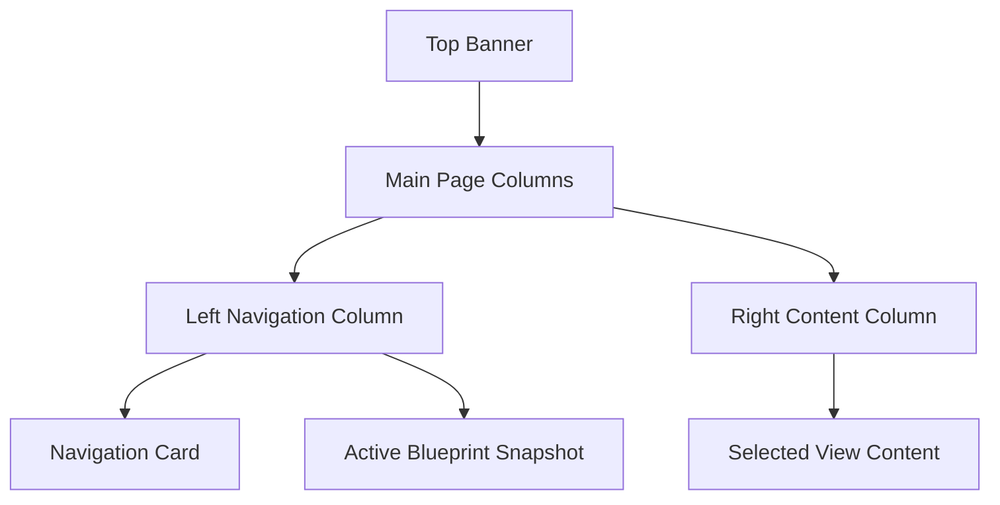

# Presentation Style Guide

This document defines the visual and interaction style of FitBlueprint. It is meant to help future contributors keep the app feeling consistent, polished, and intentional.

## Brand Feel

FitBlueprint presents itself as a **precision fitness planning dashboard** rather than a casual chatbot. The app should feel:

- Scientific, structured, and trustworthy
- Dark, modern, and high-contrast
- Coach-like, but not medical or clinical
- Premium enough for a paid fitness tool
- Simple enough for a beginner to use without instructions

The product language uses terms like **blueprint**, **CSCS**, **protocol**, **routine**, **trainee profile**, and **science-backed** to reinforce the idea of structured planning.

## Visual Identity

The current UI uses a Spotify-inspired dark theme with bright green accents.

### Primary Style Elements

| Element | Current Treatment | Purpose |
|---|---|---|
| Background | Dark app background | Keeps focus on cards and content. |
| Accent color | Bright green, commonly `#1DB954` | Signals active actions, brand identity, and success. |
| Cards | Rounded bordered containers | Makes each routine, section, or preset feel modular. |
| Badges | Compact pill components | Communicates metadata quickly: goal, days, duration, equipment. |
| Buttons | Full-width navigation/action controls | Encourages guided workflows instead of scattered interactions. |
| Hero banner | Large branded top strip | Establishes product identity before the user enters the workflow. |

## Layout Structure

The app uses a two-column layout:

### Top Banner

The top banner is rendered in `app.py` using custom HTML and CSS classes:

- `top-banner`
- `banner-content`
- `banner-brand`
- `banner-icon`
- `banner-title`
- `banner-subtitle`
- `banner-tags`
- `banner-pill`

The banner should always communicate:

1. Product name: **FitBlueprint**
2. Product role: workout plan generator / workout architect
3. Trust signals: CSCS standards, science-backed logic

### Navigation Column

The left column is intentionally narrow and persistent. It contains the four major product modes:

1. Current Routine
2. Generate Routine
3. Curated
4. Saved Routines

The active view is stored in `st.session_state.nav_selection`. When a navigation button is clicked, the app updates the value and calls `st.rerun()`.

### Content Column

The content column displays the selected view. The view router lives in `app.py` and delegates rendering to `src/ui/views.py`.

## Component Presentation Rules

### Exercise Cards

Exercise cards should be readable at a glance. Each card should surface:

- Exercise number
- Exercise name
- Sets
- Reps or time
- Rest interval
- Coaching/form cue
- Swap action

Avoid burying these details inside long paragraphs. Users should be able to scan a workout while standing in a gym.

### Metadata Badges

Badges should be used for compact facts, not long explanations. Good badge content:

- `Build muscle`
- `3 Days/Wk`
- `45 Mins`
- `Home dumbbells`
- `Intermediate`

Avoid badges for full sentences or disclaimers.

### Containers

Use `st.container(border=True)` for major grouped areas:

- Trainee profile form
- Preset cards
- Saved routine cards
- Active blueprint summary

The app should feel modular, like a dashboard made of panels.

## Tone and Copywriting

The UI copy should feel like a knowledgeable coach. It should be direct, clear, and specific.

### Good Examples

- `Generate Science-Backed Routine`
- `Analyzing biomechanics and generating your CSCS routine...`
- `Loaded for modification!`
- `Quick Add Limitation:`

### Avoid

- Overly casual copy that weakens trust
- Medical promises or diagnosis language
- Overlong explanations inside buttons
- Generic phrases like `Submit` when a more specific action exists

## Accessibility Notes

The dark UI should maintain enough contrast for all text. When adding new CSS, check that:

- Body text is readable against the dark background
- Buttons have clear hover and active states
- Green accent text is not the only indicator of state
- Important warnings and errors use Streamlit alert components
- Layouts remain usable on narrower screens

## Style Extension Checklist

When adding a new screen or feature, match the existing presentation system:

- Use a clear page title and short caption
- Group controls inside bordered containers
- Use badges for metadata
- Keep primary actions full-width when appropriate
- Use Streamlit alerts for warnings/errors
- Reuse existing CSS classes where possible
- Do not add competing brand colors unless a full redesign is intended
